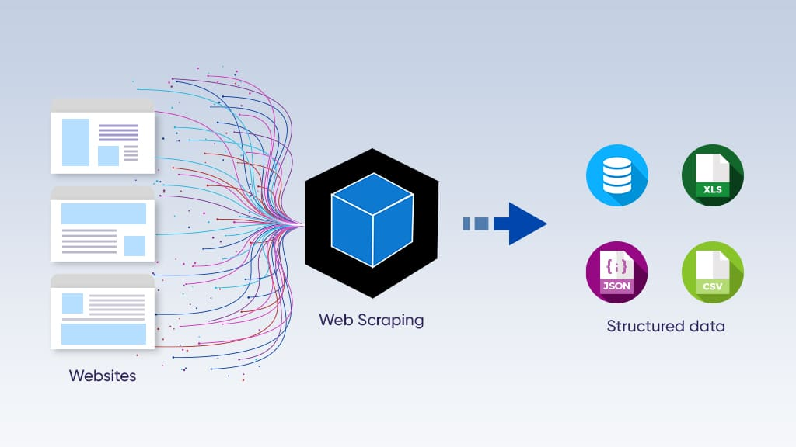

# Projet Centrale Brico : Scraping des Données Concurrentielles




## Contexte Professionnel


En tant que Data Engineer chez **Brico Simplon**, vous avez été chargé de développer une solution de scraping pour collecter des données tarifaires auprès de **Centrale Brico**, un site e-commerce spécialisé dans le bricolage et l’aménagement de la maison. 

L’objectif est de recueillir des informations sur les tarifs pratiqués par **Centrale Brico**, afin d’aider **Brico Simplon** à ajuster sa politique tarifaire et rester compétitif face aux autres acteurs du marché.

### Objectifs
- Concevoir un système de scraping pour extraire les données tarifaires des concurrents.
- Garantir la conformité légale et éthique de la collecte.
- Nettoyer et structurer les données collectées.
- Exporter les données pour une analyse approfondie.

---

## Fonctionnalités Implémentées

### 1. Création de Deux Items
- **Item des Catégories** :
  - Nom de la catégorie.
  - URL de la catégorie.
  - Identifiant unique.

- **Item des Pages de Liste de Produits** :
  - Nom du produit.
  - Prix.
  - URL du produit.
  - Identifiant unique.
  - Catégorie associée.

### 2. Développement de Deux Spiders
- **Spider pour les Catégories** :
  - Explore l’arborescence des catégories et sous-catégories.
  - Récupère les URLs de chaque catégorie et sous-catégorie.

- **Spider pour les Pages de Produits** :
  - Scrape les informations des produits (nom, prix, URL, etc.).
  - Gère la pagination.

### 3. Pipeline de Traitement des Données
- Nettoyage des données (suppression des espaces inutiles, normalisation des prix).
- Validation des données (cohérence des champs).
- Élimination des doublons via identifiants uniques.

### 4. Exportation des Données
- **Fichier CSV pour les Catégories** : `categories.csv`.
- **Fichier CSV pour les Produits** : `products.csv`.

---


## Structure du Projet

| Fichier/Dossier              | Description                                                                 |
|------------------------------|-----------------------------------------------------------------------------|
| [bricosimplon/bricospcraper](bricosimplon)             | Dossier principal du projet.                                               |
| [bricoscraper/spiders/](bricoscraper/spiders)      | Contient les spiders pour le scraping des données.                         |
| [bricoscraper/spiders/bricospider.py](bricoscraper/spiders/bricospider.py) | Spider pour scraper les categories.                              |
| [bricoscraper/spiders/produit.py](bricoscraper/spiders/produit.py)    | Spider pour scraper les produits.                        |
| [bricoscraper/items.py](bricoscraper/items.py)      | Définit les items utilisés pour stocker les données scrappées.             |
| [bricoscraper/middlewares.py](bricoscraper/middlewares.py)| Contient les middlewares pour Scrapy (options avancées de traitement). (non utilisé)    |
| [bricoscraper/pipelines.py](bricoscraper/pipelines.py)  | Pipeline pour traiter, nettoyer et valider les données scrappées.          |
| [bricoscraper/runner.py](bricoscraper/runner.py)     | Script pour pointer ou ça beugu                                        |
| [requirements.txt](requirements.txt)           | Liste des dépendances Python nécessaires pour le projet.                   |
| [scrapy.cfg](scrapy.cfg)                | Fichier de configuration Scrapy pour définir le projet.                    |
| [bricospider.csv](bricospider.csv)           | Export des données brutes scrappées au format CSV.                                                           |
| [.gitignore](.gitignore)              | Liste des fichiers et dossiers à ignorer par Git (cache, logs, etc.).      |


---

## Installation et Utilisation

### Prérequis
- Python 3.8+


### Étapes d’installation

Clonez le dépôt Git :

   ```bash
   git clone <git@github.com:ludivineRB/bricosimplon.git>
   ```

## Instructions

### Installez les dépendances :
```bash
pip install -r requirements.txt
```

### Lancer les spiders

#### Pour scraper les catégories :
```bash
scrapy crawl bricospider
```

#### Pour scraper les produits :
```bash
scrapy crawl produit
```

### Exportation des données
```text
Les données scrappées sont exportées automatiquement dans les fichiers :
- categories.csv : Liste des catégories.
- products.csv : Détails des produits.
```
